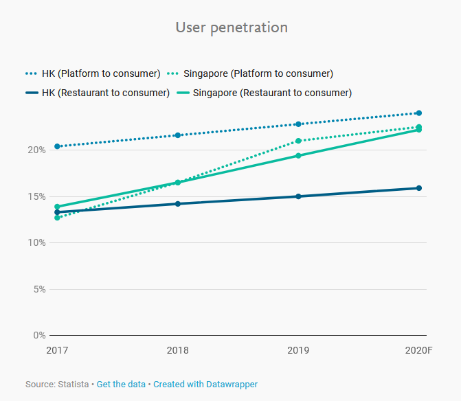
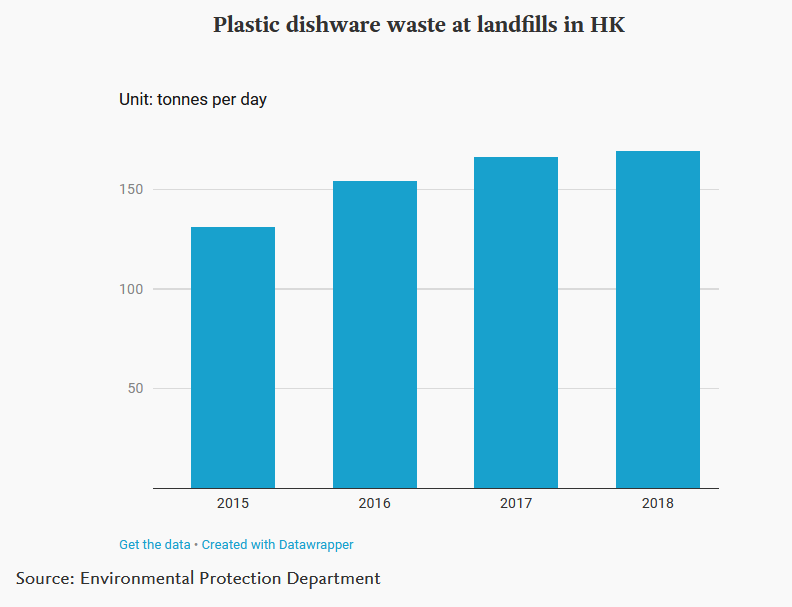
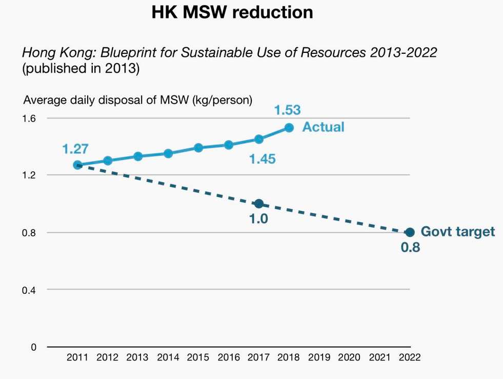
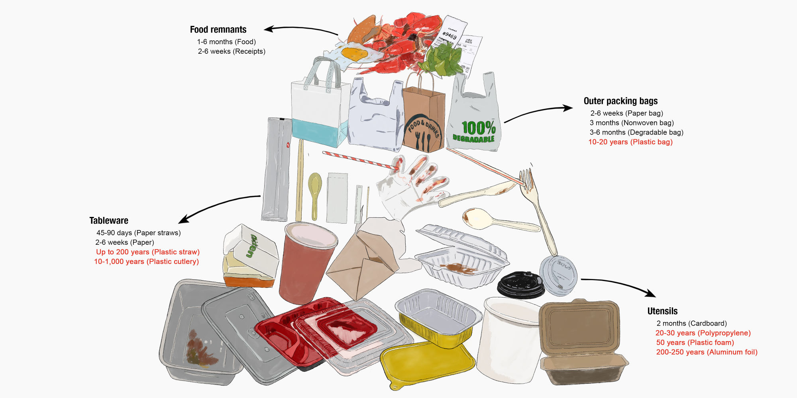
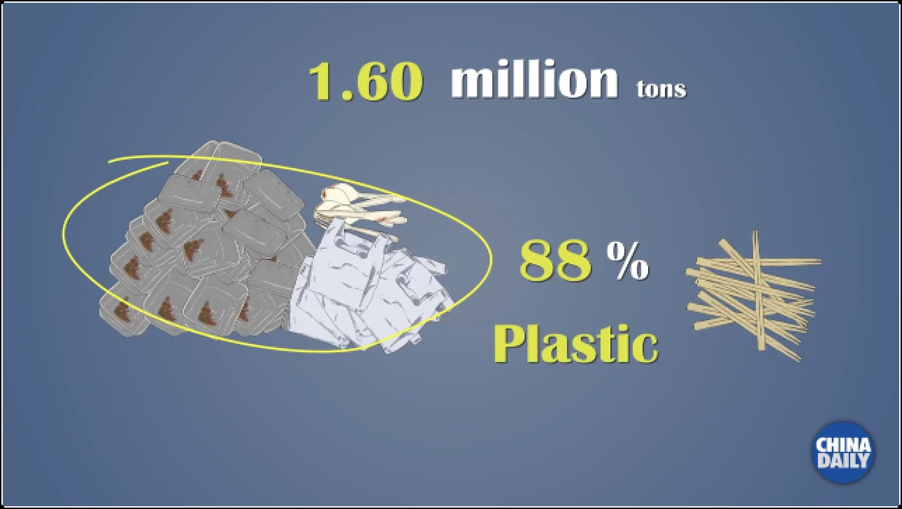

<div align='center' ><font size='70'>Project 2</font></div>

---

student_id

id 1:  

id 2: 320180939721 Fan Delin

id 3: 

id 4: 

---

##  Abstract

​    ***Our project aims to<font  size=4, color="blue"> present the yearly increasing use of plastics and the proportion of plastic waste of he food and beverage industry to call for people</font> to <font size=4, color="red">reduce disposable plastic products use in platform</font>.***

---

## 1. ```Introduction```

---

​    We using four images to show that <font color="blue">**more people choose to point takeaway and eat out, which result in the increase of plastic waste that are already out of the expected average**</font>.  And we use three pictures as arguments.

<center class="third">
<center class="3">



</center>


But Those pictures get the following problems:

* **Picture 1 : **
  1. Good Point: This picture use line plot to visualize the information, so it not only show data intuitively, but also presents the trend.
  2. Bad Point: Unfortunately, this picture gives multi-dimensional comparison, and according to the cognitive theory, it is not good for humans'            working memory.
  3. Improvements: We can separate the picture into other pictures and each picture only compare one thing different.
* **Picture 2 : ** 
  1. Good Point: Absolute magnitudes are important for bar plot and this picture start from 0 fitting this rule.
  2. Bad Point: However, this picture do not show enough about the relative magnitudes, which is the plot want to show.
  3. Improvements: We can use line plot, or use lumpy profile. Also add the max number on the top of the bar may be another good idea.
* **Picture 3 : ** 
  1. Good Point: The picture use line chart to show the trend of data, and it can be known that the difference between two lines is becoming bigger and bigger.
  2. Bad Point: But it is still not intuitive enough, because the picture want to show the difference instead of trend. Beside, the data is not complete.
  3. Improvements: We can use area plot to re-show these data.

---


## 2. ```Background```

---

This part will show the background of the whole work

* <font color="blue">Plastic will finally back to human</font>

  Plastic takes 10 to 1,000 years to decompose into microplastics, which flow through groundwater into the sea. They return via the marine food chain to people. So reducing plastic waste is urgent. And the WWF urged the government to set a phaseout of all single-use plastic cultery by 2022.

* <font color="blue">Eating takeaway contributes to plenty of plastic waste</font>

  

  This obviously shows the quantity and types of those plastic waste.
  
  <figure>
  	
      And it is unbelievable that plastic waste accounts for 88%!
  </figure>

---


## 3. ```Event```

---

1. <font color="green">Plastic Waste Comes More</font>

   <center class="half">
       Realized
   	
       VS
   	
       Improved
   </center>

   The left picture is what we realized and right one is what we improved. 

   The original picture gets the following questions:

   * Too much variable and not easy for people to understand

     And we improve those shortcomings with the following method:

   * M1

   * M2

     

2. <font color="Blue">  Plastic Waste at Landfills in HK</font>

   <center class="half">
       Realized
   	
       VS
   	
       Improved
   </center>

   The left picture is what we realized and right one is what we improved. 
   
   The original picture gets the following questions:
   
   * The contrast is not enough
   
     And we improve those shortcomings with the following method:
   
   * M1
   
   * M2
   
     
   
3. <font color="orange"> HK MSW Reduction</font>

   <center class="half">
       Realized
   	
        VS
   	
       Improved
   </center>
   
   The left picture is what we realized and right one is what we improved. 
   
   The original picture gets the following questions:
   
   * Data Missing
   
   * line plot is not good for showing difference
   
     And we improve those shortcomings with the following method:
   
   * M1
   
   * M2


## 4. ```Reveal```

---

* Graphical Type

  A good type of graph can help people understand more about the idea that one wants to express. For example,  the area plot is more suitable for third picture

* Graphical Integrity

  A good graph should not use multiple dimension, and not imply unintended text. Also label is important. The first graph has two many dimensions, the second one should give some number.

* Graphical Excellence

  When we make a graph, how to make it easy for people to understand is important. The second do not show enough contrast, and the first graph is not kind to humans' working memory. 


## 5. ```Conclusion```

---


