<div align='center' ><font size='70'>Project 2</font></div>

---

student_id

Id 1:  320180939641 Zeyang Cui

Id 2:  320180939721 Delin Fan

Id 3:  320180939951 Ziyuan Li

Id 4:  320180940581 Yuhao Zhang

---

##  Abstract

​    ***Our project finish the work that <font  size=4, color="blue"> fixing the problems of three graphs in an article to make them show their intention better</font>***.

---


## 1. ```Introduction```

---

WWF research shows the average person consumes 2,000 tiny pieces of plastic a week. That's like eating a VISA card(5 grams) a week or eating a plastic hangers(21 grams) a month. We get a sense of the seriousness of the problem from an article in Chinadaily. And we improve the information visualization of the three pictures in this article. The aim is to help people visually realize the importance of limiting the use of plastic tableware and reducing the amount of plastic discarded.

---


## 2. ```Background```

---

So how does this happen?

* **<font color="blue">Plastic will finally back to human</font>**

  Plastic takes 10 to 1,000 years to decompose into microplastics, which flow through groundwater into the sea. They return via the marine food chain to people. So reducing plastic waste is urgent.

* **<font color="blue">Eating takeaway contributes to plenty of plastic waste</font>**

  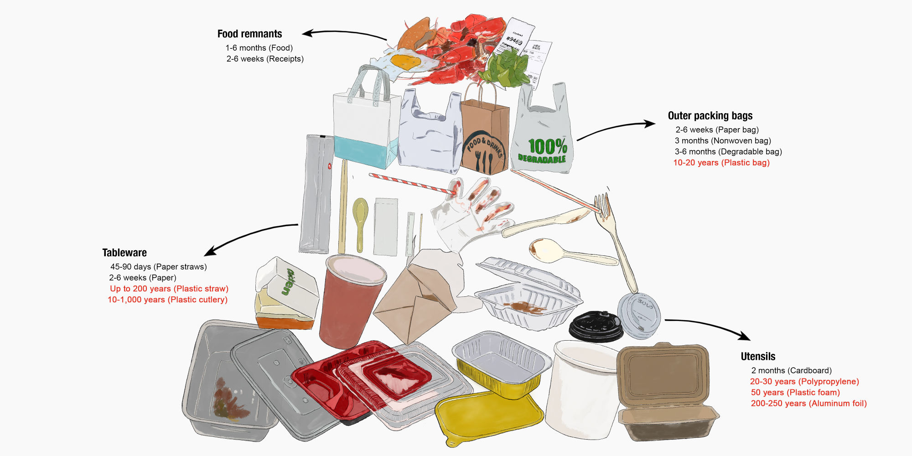

  Based on the TAKEOUT WASTE PYRAMID DECOMPOSITION TIME diagram we can visually see the DECOMPOSITION TIME of take-out garbage.
  
  <figure>
  	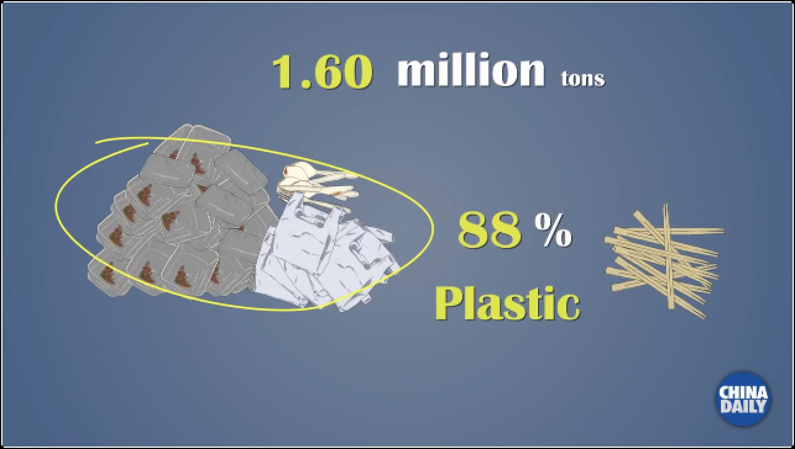
      In particular, plastic waste accounts for 88 per cent of disposable tableware.
  </figure>

The three images show that in Hong Kong, China, more people are opting for take-out or in-room meals, leading to a 30 percent increase in the number of plastic tableware discarded from landfills in four years, from 131 metric tons a day to 169 metric tons. Meanwhile, the increase in the amount of municipal solid waste (MSW) disposed of per capita in landfills makes Hong Kong's policy target of reducing waste per capita to 0.8 kg by 2020 unrealistic. Here is a brief analysis of the three pictures:

1. 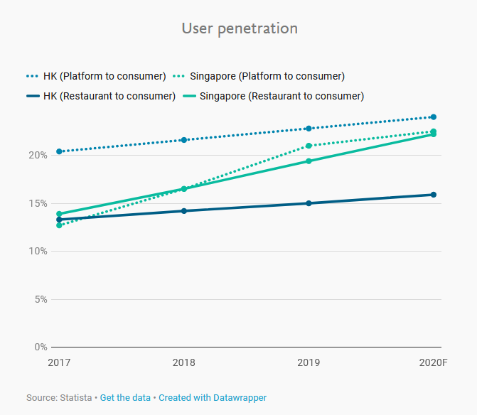
  * Information: This chart uses lines to depict the trends in the popularity of take-out/in-room meals in different regions (Hong Kong/Singapore) over the years.
  * Visual patterns: point position in the figure.
  * Data type: X-axis is year, Y-axis is percentage (penetration rate).
  * Meaning: The chart reveals the rise in the proportion of take-out and in-room food in the two regions, which reflects the rise in the use of disposable tableware.

2. 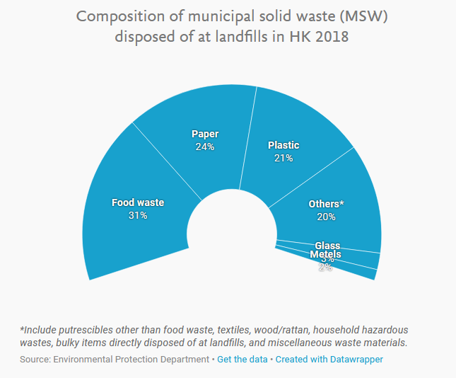
  * Information: This chart shows how the amount of discarded plastic dining ware at landfills in Hong Kong varies by year
  * Visual patterns: size(height) of the bar, position of the bar.
  * Data type: categorical(year) and discrete(column height).
  * Meaning: The number of tableware landfills in Hong Kong has been increasing for several years.

3. 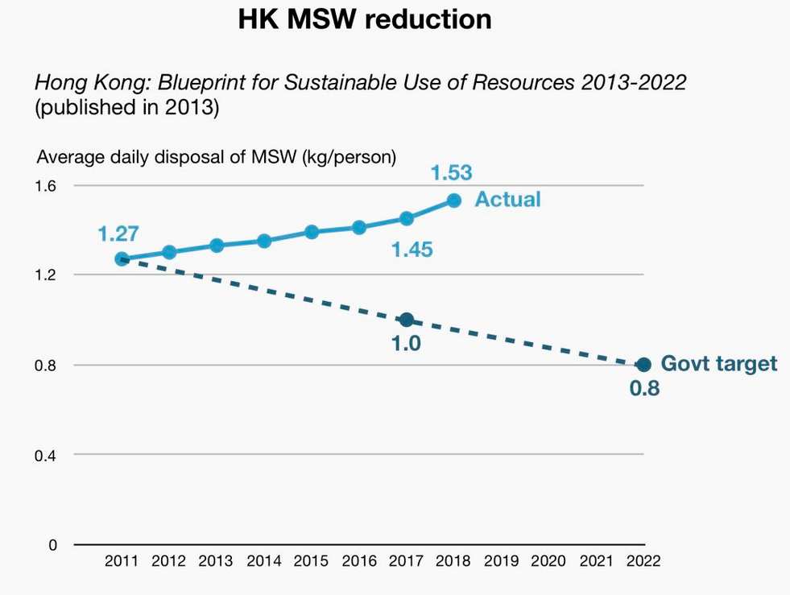
  * Information: This chart compares the Hong Kong government's expectations for the amount of solid waste dumped per person per day from 2011 to 2022.
  * Visual patterns: point position in the figure.
  * Data type: X-axis is year, Y-axis is the amount of solid waste discarded per capita on a daily basis(kg/person).
  * Meaning: The gap between Hong Kong's actual MSW and the government's expectations is widening.
---


## 3. ```Improve Visualization```

---

1. <font color="green">Plastic Waste Comes More</font>

   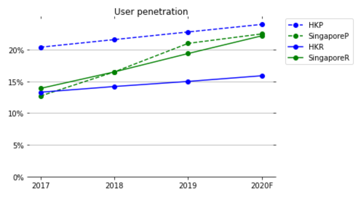<font color="blue">Realized</font>

   (The above picture is what we replicated and blow one is what we improved.) 

  * Good Point: This picture use line plot to visualize the information, so it not only show data intuitively, but also presents the trend.
  * Bad Point: Unfortunately, this picture gives relatively multi-dimensional comparison, and according to the cognitive theory, which may occupy the cognitive tunneling, making it difficult to understand.
  * Improvements: We divided the data into multiple graphs to reduce the dimension of data comparison at the same time, for example, small Multiple (Trellis chart/lattice chart) was used.

   We ultimately made the following improvements:

   * A small multiples containing four subgraphs are used.
   * Adjust the range of the Y-axis to make the change in the data more obvious.
      	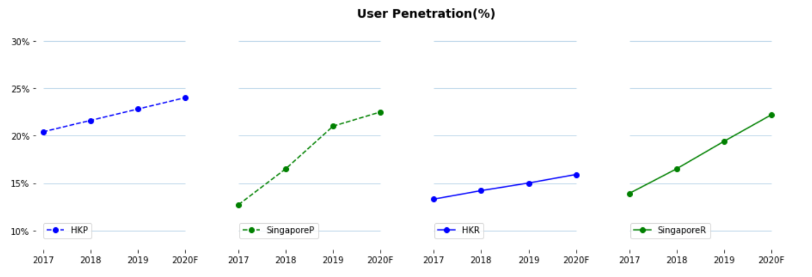

   	<font color="red">Improved</font>

   

2. <font color="Blue">  Plastic Waste at Landfills in HK</font>

   <center class="half">
   	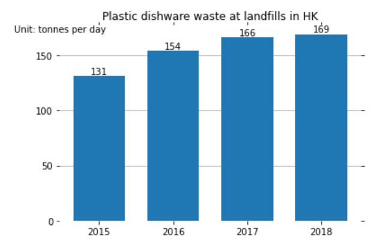
       VS
   	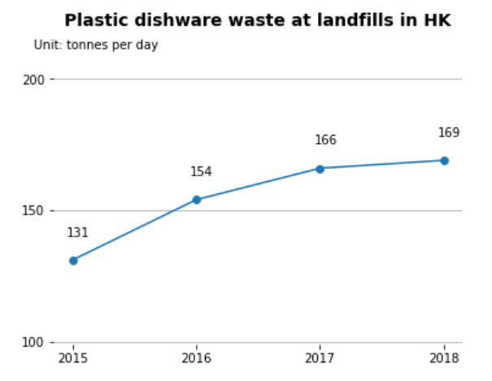
   </center>

   ​                                                              <font color="blue">Realized</font>                                                                                                     <font color="red">Improved</font>

   (The left picture is what we replicated and right one is what we improved.) 

*  Good Point: Absolute magnitudes are important for bar plot and the baseline of this picture starts from 0 fitting this rule.

* Bad Point: As time series data, the selection of bar chart cannot directly reflect the change of trend.

* Improvements: We can use line plot, or use lumpy profile. Also add the max number on the top of the bar may be another good idea.


We ultimately made the following improvements:


* We use line plot to present the trend of quantity of plastic dishware waste .


* Show the trend by marking the maximum value.

     

3. <font color="orange"> HK MSW Reduction</font>

   <center class="half">
   	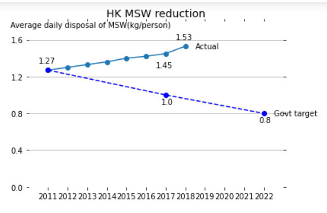
       VS
   	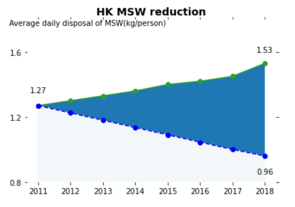
   </center>

   ​                                                       <font color="blue">Realized</font>                                                                                                                          <font color="red"> Improved</font>

   (The left picture is what we replicated and right one is what we improved.) 

  * Good Point: The picture use line chart to show the trend of data, and it can be known that the difference between two lines is becoming bigger and bigger.
  * Bad Point: But it is still not intuitive enough, because the picture want to show the difference instead of trend. Beside, the data is not complete， which raises doubts about comparability.
  * Improvements: We can use area plot to re-show these data.

   We ultimately made the following improvements:

   * We have to throw away the data after 2018 because there is still no relevant data on the government official website.
  
   * Calculate the corresponding data points and show only the full year of the data.

   * We use area plot to present the increasing distance.

---

## 4. ```Future Work```

---
After finishing our visualization and analyzing, we recognize that the situation is not optimistic. When we searched the data from the offical website, the latest data was gathered in 2018. It illustrates that the Hong Kong government doesn't make this project go ahead successfully. Or the work is so hard for each person to do. The principle of reducing plastic tableware needs everyone in this society to obey. For the future, we call for the government to make policy and law to limit the using of plastic contaminant, especially tableware. More importantly, the public need to have responsibility and awareness to reduce the use of plastic tableware in order to contribute to environment protection.

For future work, we will keep using visualization and relevant methods (use our knowledge and technic) to improve residents' awareness of protecting our environment. Except plastic tableware, we will analyse much more other fields of environment protection for instance water cycling and industrial waste gas. When we draw enough pictures, we are willing to contact with local council and exhibit these images even animation to civilian by helps from administration.


## 5. ```Conclusion```

---

We have make change selected graphs to let them show better for their original meaning that the author what to express. But we do not think those pictures can greatly explain why limiting single-use plastic waste use in eating takeaway is urgent for HK, this is because those data do not show damage plastic waste has caused to HK's environment, and we want to realize it with more data. We believe that this is the most direct way to show thrust.

* **Graphical Type**

  A good type of graph can help people understand more about the idea that one wants to express. For example,  the area plot is more suitable for third picture

* **Graphical Integrity**

  A good graph should not use multiple dimension, and not imply unintended text. Also label is important. The first graph has two many dimensions, the second one should give some number.

* **Graphical Excellence**

  When we make a graph, how to make it easy for people to understand is important. The second do not show enough contrast, and the first graph is not kind to humans' working memory. 
