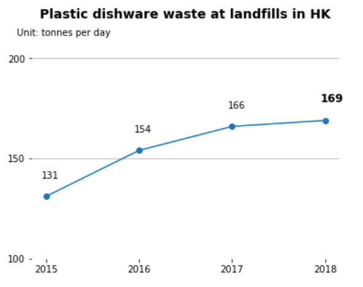

<div align='center' ><font size='70'>Do we eat a VISA card a week?</font></div>

---

student_id

Id 1:  320180939641 Zeyang Cui

Id 2:  320180939721 Delin Fan

Id 3:  320180939951 Ziyuan Li

Id 4:  320180940581 Yuhao Zhang

---

##  Abstract

​    *The growth of the food delivery industry has created a demand for disposable tableware, where discarded plastic tableware poses a major environmental hazard. We analyzed and improved the chart based on data from the Environmental protection department of the Hong Kong Government of China, under the guidance of the visualization principle.*

---


## 1. ```Introduction```

---

Research by the World Wildlife Fund shows that the average person consumes 2,000 pieces of plastic a week. It's like eating a VISA card a week (5 grams) or a plastic hanger a month (21 grams).

We chose three diagrams related to this issue as our project materials for information visualization. This article describes how we analyzed the visual patterns of these graphs according to the visualization principles and improved the visualization. On the one hand, this helps us deepen our understanding of the concept of visualization. On the other hand, these improvements help people visually recognize the importance of limiting the use of plastic tableware and reducing the amount of plastic thrown away.

---


## 2. ```Background```

---

So how does this happen?

1. **<font color="red">Background of Chart</font>**

    * **<font color="blue">Plastic will finally back to human</font>**

      Plastic takes 10 to 1,000 years to decompose into microplastics, which flow through groundwater into the sea. They return via the marine food chain to people. So reducing plastic waste is urgent.

    * **<font color="blue">Eating takeaway contributes to plenty of plastic waste</font>**

      <center class="half">
        
        
      </center>
    
      Based on the TAKEOUT WASTE PYRAMID DECOMPOSITION TIME diagram we can visually see the DECOMPOSITION TIME of take-out garbage.   In particular, plastic waste accounts for 88 per cent of disposable tableware.


2. **<font color="red">Preliminary Analysis</font>**

    The three images show that in Hong Kong, China, more people are opting for take-out or in-room meals, leading to a 30 percent increase in the number of plastic tableware discarded from landfills in four years, from 131 metric tons a day to 169 metric tons. Meanwhile, the increase in the amount of municipal solid waste (MSW) disposed of per capita in landfills makes Hong Kong's policy target of reducing waste per capita to 0.8 kg by 2020 unrealistic. Here is a brief analysis of the three pictures:

    1. 
        * **Information:** This chart uses lines to depict the trends in the popularity of take-out/in-room meals in different regions (Hong Kong/Singapore) over the years.
        * **Visual patterns:** point position in the figure.
        * **Data type:** X-axis is year, Y-axis is percentage (penetration rate).
        * **Meaning:** The chart reveals the rise in the proportion of take-out and in-room food in the two regions, which reflects the rise in the use of disposable tableware.

    2. 
        * **Information:** This chart shows how the amount of discarded plastic dining ware at landfills in Hong Kong varies by year
        * **Visual patterns:** size(height) of the bar, position of the bar.
        * **Data type:** categorical(year) and discrete(column height).
        * **Meaning:** The number of tableware landfills in Hong Kong has been increasing for several years.

    3. 
        * **Information:** This chart compares the Hong Kong government's expectations for the amount of solid waste dumped per person per day from 2011 to 2022.
        * **Visual patterns:** point position in the figure.
        * **Data type:** X-axis is year, Y-axis is the amount of solid waste discarded per capita on a daily basis(kg/person).
        * **Meaning:** The gap between Hong Kong's actual MSW and the government's expectations is widening.
---


## 3. ```Improve Visualization```

---

1. **<font color="green">Plastic Waste Comes More</font>**

   

   (The above picture is what we replicated and below one is what we improved.) 

    * Good Point: This picture use line plot to visualize the information, so it not only show data intuitively, but also presents the trend.
    * Bad Point: Unfortunately, this picture gives relatively multi-dimensional comparison, and according to the cognitive theory, which may occupy the cognitive tunneling, making it difficult to understand.
    * Improvements: We divided the data into multiple graphs to reduce the dimension of data comparison at the same time, for example, small Multiple (Trellis chart/lattice chart) was used.
   
      We ultimately made the following improvements:
      
        * A small multiples containing four subgraphs are used.
        * Considering a ‘lumpy profile’ is created by setting the limits on the plot as close as possible to the magnitude of the dataset range, and improves visualization of variability and eliminates white or wasted space (Robbins, 2005 [pp. 239–241; 285]; Tufte, 2006 [p. 60]; Strange, 2007 [p. 89]). We adjust the range of the Y-axis to make the change in the data more obvious.
      	

   


2. **<font color="Blue">  Plastic Waste at Landfills in HK</font>**

   <center class="half">
    VS
   </center>


   (The left picture is what we replicated and right one is what we improved.) 

    * Good Point: Absolute magnitudes are important for bar plot and the baseline of this picture starts from 0 fitting this rule.
    
    * Bad Point: As time series data, the selection of bar chart cannot directly reflect the change of trend.
    
    * Improvements: We can use line plot, or use lumpy profile. Also add the max number on the top of the bar may be another good idea.
    
      We ultimately made the following improvements:
    
        * Since focus on visualizing patterns or on visualizing details, depending on the purpose of the plot (Few, 2004a; Kosslyn and Chabris, 1992), we use line plot to present the trend of quantity of plastic dishware waste.
    
        * Show the trend by marking the maximum value.


​     

3. **<font color="orange"> HK MSW Reduction</font>**

   <center class="half">
   	VS
   </center>
   
   


(The left picture is what we replicated and right one is what we improved.) 

    * Good Point: The picture use line chart to show the trend of data, and it can be known that the difference between two lines is becoming bigger and bigger.
       
    * Bad Point: But it is still not intuitive enough, because the picture want to show the difference instead of trend. Beside, the data is not complete， which raises doubts about comparability.

 * Improvements: We can use area plot to re-show these data.
   
   We ultimately made the following improvements:
   
        * We have to throw away the data after 2018 because there is still no relevant data on the government official website.
        
        * Calculate the corresponding data points and show only the full year of the data.
        
        * We use area plot to present the increasing distance.

---

## 4. ```Future Work```

---
After finishing our visualization and analyzing, we recognize that the situation is not optimistic. When we searched the data from the offical website, the latest data was gathered in 2018. It illustrates that the Hong Kong government doesn't make this project go ahead successfully. Or the work is so hard for each person to do. The principle of reducing plastic tableware needs everyone in this society to obey. For the future, ***we will call for the government to make policy and law to limit the using of plastic contaminant, especially tableware***. More importantly, ***the public need to have responsibility and awareness to reduce the use of plastic tableware in order to contribute to environment protection***.

Also, we will ***keep using visualization and relevant methods (use our knowledge and technic) to improve residents' awareness of protecting our environment***. Except plastic tableware, we will analyse much more other fields of environment protection for instance water cycling and industrial waste gas. When we draw enough pictures, we are willing to contact with local council and exhibit these images even animation to civilian by helps from administration.


## 5. ```Conclusion```

---

After the completion of this visualization task, we summarize the general idea of improving the visualization effect according to the content we have learned. In order to improve the visualization, we thought about the following aspects:

* **Graphical Type**

  For different visualization problems, we should ***choose the type of graph that is most appropriate***. This will greatly affect the delivery of information. For example, in order to improve the third diagram in this article, area plot could be selected to better highlight the variation of space between two lines.

* **Graphical Integrity**

  ***There should be no misunderstanding when visualizing data***. This means that the chart should faithfully reflect the original relationship of the data. For example, in the second chart of this article, the baseline of the bar chart starts at 0, which accurately reflects the scale gap of the values.

* **Graphical Excellence**

  ***Readability is a golden rule when we make graphs***. If too many dimensions of data are added to a graph, it can easily overwhelm the working memory of a person and affect the reception of information. For example, in the first figure of this paper, it is more intuitive to compare the two dimensions of user penetration, the region and the way of eating, rather than decompose them into sub-figures for comparison.

### ```Reference```

* Source of chart: "Take plastic out of food delivery" By Shadow Li (Published March 30, 2020) http://cdhkdata.chinadailyhk.com/takeoutwaste

* Statement reference:  
  * "Ten guidelines for effective data visualization in scientific publications" By Christa Kelleher, ThorstenWagener https://www.sciencedirect.com/science/article/pii/S1364815210003270?via%3Dihub#bib6
  * "11 Design Tips for Data Visualization" By Charlie Custer https://www.dataquest.io/blog/design-tips-for-data-viz/
  * "Data Visualization Principles: Lessons from Tufte" By Mike Pantoliano https://moz.com/blog/data-visualization-principles-lessons-from-tufte
